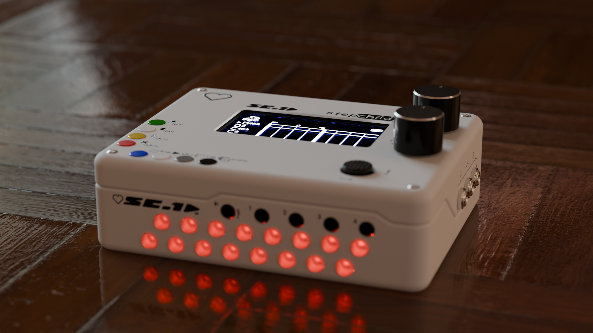
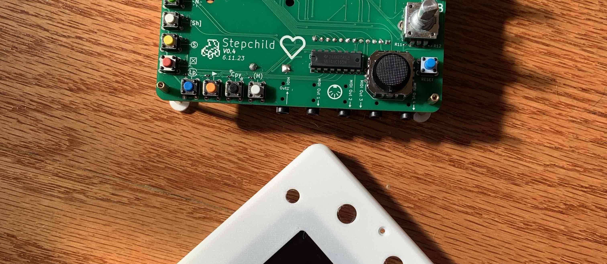
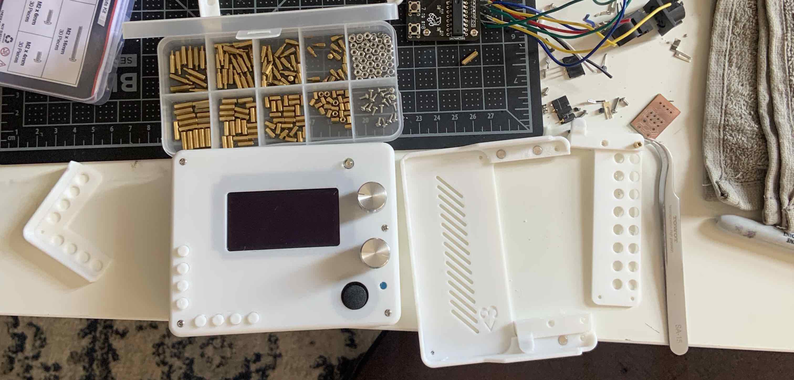
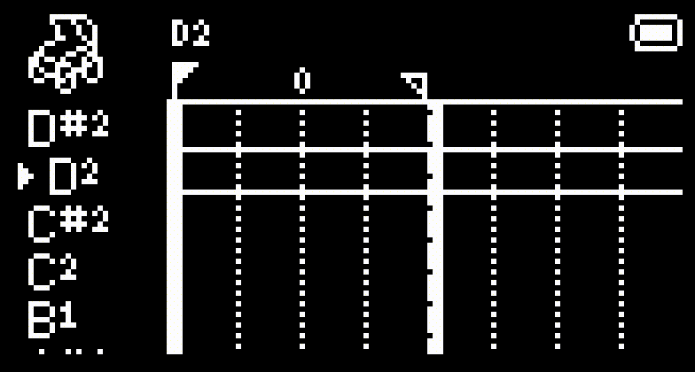
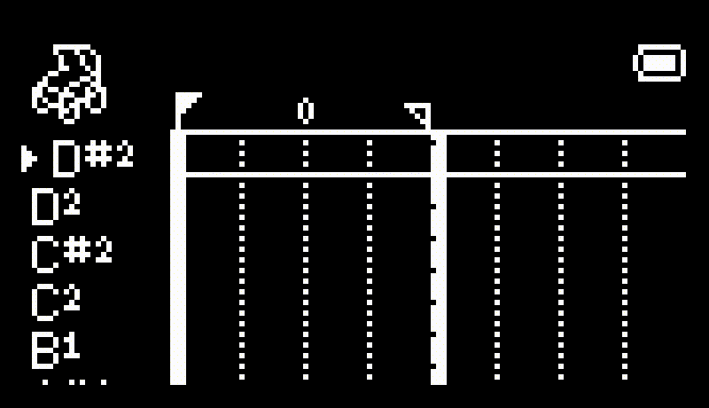
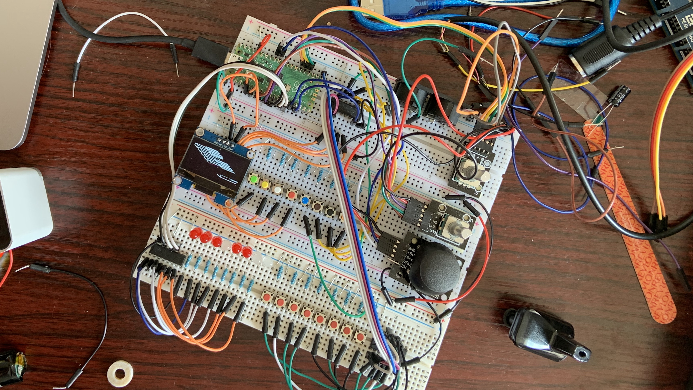

<!--  -->
Ahhh don't look at me i'm a work in progress!

<!--  -->

<!-- intro -->
# The Stepchild
[cc-by-nc-sa-shield]: https://img.shields.io/badge/License-CC%20BY--NC--SA%204.0-lightgrey.svg
[cc-by-nc-sa]: http://creativecommons.org/licenses/by-nc-sa/4.0/
&color=rgb(255%2C100%2C0)
)) [![CC BY-NC-SA 4.0][cc-by-nc-sa-shield]][cc-by-nc-sa] 

  
**Welcome to the github page for the Stepchild MIDI instrument project,** an open source, generative MIDI instrument designed to be a portable step-sequencer and experimental songwriting tool built around the Pi Pico and a love for drum sequencing.

The Stepchild contains a flexible step-sequencer, CC automation and envelope data, experimental realtime MIDI instruments (you can also [make your own]()), a sequence editor including note FX, an onboard filesystem for sharing sequences, an arpeggiator, a live MIDI looper, CV output (natively +3.3V, eurorack power supply required for +12V), a Program Change sequencer, a MIDI console for debugging MIDI setups, and flexible port routing for using the Stepchild as a MIDI interface. The Stepchild has **4 MIDI outputs** and **1 MIDI input**, each of which is accessible through a TRS and classic DIN jack for max compatibility, and one input/output port via **USB MIDI**.

## Open Source
The Stepchild is an **open source project** which means you can contribute to, remix, create your own version of, and copy the hardware & software designs that are a part of the project, with some restrictions. The Stepchild's physical design is released under the [Creative Commons Attribution-NonCommercial-ShareAlike 4.0 International License][cc-by-nc-sa], which is a **non-commercial** license, but get in touch with the project if you'd like to talk about selling your own version of the Stepchild or something Stephild related! The Stepchild's software is licensed under the [GNU General Public License v3.0](https://www.gnu.org/licenses/gpl-3.0.html) and can be found in the [code](code/stepchild) folder.
<!-- 
[cc-by-nc-sa-image]: https://licensebuttons.net/l/by-nc-sa/4.0/88x31.png
[![CC BY-NC-SA 4.0][cc-by-nc-sa-image]][cc-by-nc-sa] -->

### Having a Child
The Stepchild can be purchased as either a [complete instrument]() or several [kits]() from the Stepchild site, or you can build your own from scratch by following the [build guide]. The Stepchild kit is designed to be relatively easy to assemble and modify and comes with partially preassembled PCBs -- making your own Stepchild is encouraged! The purpose of kits is to make it cheaper and easier for those who wants to DIY their Stepchildren.

# Project Overview
Please see the [Manual](manual/manual.md) for a guide to creating music with the Stepchild. If you're looking to make your own, please also take a look at the [Build Guide]() which gives an overview of the materials and process for building one of your own.

## Hardware
The Stepchild's current hardware version is ***v0.9.2***. The design files include:

**PCB**
- Main PCB
- CV Breakout PCB
- Lower LED Buttons PCB
- MIDI Breakout Board ***(Rack Mount Only)***
- Eurorack Face Plate ***(Rack Mount Only)***

**Case**
- [Top](build/case/Top.stl) & [Bottom Shell](build/case/Bottom.stl)
- [Battery](build/case/BatteryClip.stl) & [Eurorack](build/case/EurorackClip.stl) compartment clips
- [Silkscreen Graphics](build/silkscreen/graphics.svg)

The Stepchild has 4 hardware MIDI out ports and 1 hardware MIDI In port, supporting both 3.5mm TRS and the original 5-pin-DIN connector MIDI standard, as well as USB MIDI in/out using the Pi Pico's microUSB port. In total, up to 8 instruments and 1 computer can be connected to output channels from the Stepchild on 4 separate hardware ports.

<!--  -->

## Software

The Stepchild is powered by the onboard Raspberry Pi Pico which can be flashed using the Arduino IDE or Platform.io/VS Code. The official Stepchild software is **ChildOS**.

ChildOS has a powerful sequencer, looper, and Automation function generator, as well as 9 instruments and FX. There are a total of 16 Instrument slots and 24 FX slots that can be swapped with user-created code written in C++ (See documentation on [creating custom instruments]() for a tutorial).

### Main Features:
1. A graphical interface
2. A step sequencer
3. A note editor
4. A track editor
5. A CC Automation ("Autotrack") sequencer
6. A customizeable looper, with up to 256 loops of any length
7. An onboard file system
8. A randomizer
9. An arpeggiator
10. A console to view incoming MIDI data
11. A customizeable clock, integrated with Autotracks for weird timing

### Instruments & FX:
1. Joystick-to-CC -- <i>Use the Stepchild's joystick as a MIDI controller</i>
2. Rain           -- <i>Generate ambient notes</i>
3. Rattlesnake    -- <i>Output notes wth varying speed</i>
4. Knobs          -- <i>Use the Stepchild's encoders as MIDI controllers</i>
5. Quantizer
6. Humanizer
7. Strum
8. Echo
9. Reverse

# Filesystem & ChildOS Interface

The Stepchild uses [LittleFS](https://github.com/littlefs-project/littlefs) to set aside 1MB of the Pico's onboard flash memory for storing songs and sequences. [ChildOS Interface](https://github.com/alexlafetra/childOSInterface) is a standalone Java app that lets you download saved files from the Stepchild and convert .child files into .MIDI files, for playback in a DAW. Additionally, .child files from one Stepchild can be shared between Stepchild(ren).

# Contributors & Thank You's
<!-- libraries childOS relies on -->
The Stepchild's hardware and software is created using the hard work of a lot of other people. A special thanks to the creators and maintainers of the following projects that ChildOS uses:

 * The [EuroPi Project](https://github.com/Allen-Synthesis/EuroPi) started by [Allen Synthesis](https://www.allensynthesis.co.uk/index.html), specifically for providing the design for the analog CV out circuit
 * FortySevenEffect's [MIDI Library](https://github.com/FortySevenEffects/arduino_midi_library)
 * [TinyUSB](https://github.com/hathach/tinyusb)
 * [Adafruit GFX Library](https://github.com/adafruit/Adafruit-GFX-Library) and the [Adafruit SSD1306 Library](https://github.com/adafruit/Adafruit_SSD1306)
 * [LittleFS project](https://github.com/littlefs-project/littlefs)
 * Earle Philhower's [Arduino-Pico Core](https://github.com/earlephilhower/arduino-pico)
 * [KiCad](https://www.kicad.org/) <3 & [Blender](https://www.blender.org)

 Please see the [license.txt]() doc for full credits.

 

# Version History

## *Software*

## *Hardware*

### **v0.9**
*6/7/24*
- Printable clip covers for Eurorack IDC jack and battery compartments on bottom shell
- New graphics & net labels on the PCB design
- Prototype version of switchable +3.3v<-->+12v circuit to swap between Eurorack power and Battery power
- +12v indicator LED
- Centered OLED screen on PCB
