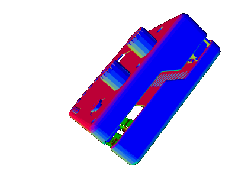
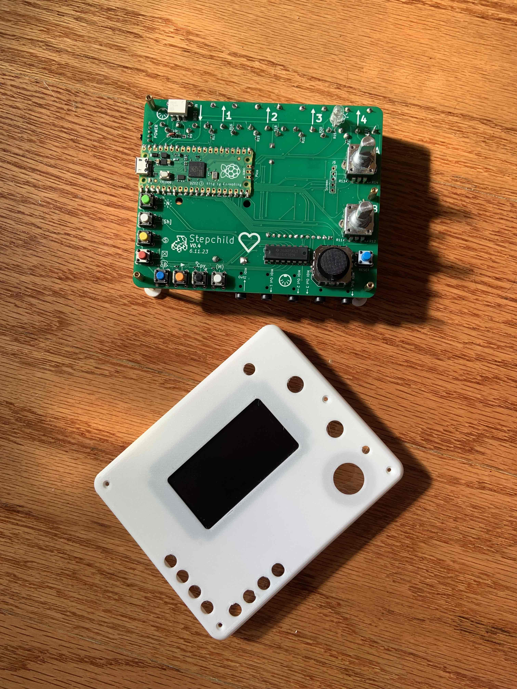
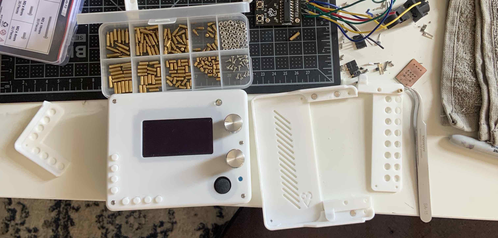

<!--  -->

<p align="center">
  
</p>

<h1 align="center">
<i>The Stepchild</i>
</h1>

<!-- borrowing heavily from the europi page -->

<!-- intro -->
  
Welcome to the github page for the Stepchild! This is an open source, generative MIDI instrument, designed to be part step-sequencer, part notebook, and part utility.

The Stepchild has the capability to record and playback sequences of MIDI data while generating its own explorative MIDI data to sequence other instruments. It can act as a tool for writing music and for interfacing between MIDI, CV, and USB protocols. The Stepchild is designed to run on a Raspberry Pi Pico and is totally customizeable using the Arduino IDE.

<!-- links to social media, reddit, website -->



<!-- capabilities -->
  

# Hardware:

The Stepchild has 4 hardware MIDI out ports and 1 hardware MIDI In port, supporting both 3.5mm TRS and the original MIDI standard. The Stepchild also has USB MIDI in/out using the Pi Pico's USB port. In total, up to 8 instruments and 1 computer can be connected to output channels from the Stepchild on 4 separate hardware ports.

The firmware running on the Stepchild is called 'ChildOS' and is designed to be easy to use and to create new generative MIDI instruments and effects for. Everything is
run by the two cores of the onboard Pi Pico.




The heart of the Stepchild is a Raspberry Pi Pico, which is a cheap, accessible microcontroller. The electronics of the Stepchild are split into two boards; on the top board, the Pico drives a monochrome 128x64 OLED screen, 8 main buttons, two rotary encoders, and an XY joystick. The Stepchild also exposes 3 extra pins for CV
(although the MIDI-CV features still need to be tested) and one for accessing the Pico's ADC to read in data from a 3.3v analog sensor. The bottom board holds the 8 step-buttons and indicator LEDs.

A basic map of the top controls:

```
                  In 1  Out 1 Out 2 Out 3 Out 4
                   ^     ^     ^     ^     ^
                   |     |     |     |     |		  .--------.	
                   |     |     |     |     |             / Controls |
                .-------------------------------.  	.========================.
              +                                  +	|  In --  MIDI Input     |
              .                             _    . 	|  1  --  MIDI Output 1  |
              |        ._______________.  / A \  | 	|  2  --  MIDI Output 2  |
              |        | \00000\   \000|  \ _ /  | 	|  3  --  MIDI Output 3  |
USB In/Out <--|        |\ \00000\   \00|    _    | 	|  4  --  MIDI Output 4  |
              |        |0\ \00000\   \0|  / B \  | 	|                        |
              |        |00\ \00000\   \|  \ _ /  | 	|  A -- Rotary Encoder A |
              |  (+)   *---------------*         | 	|  B -- Rotary Encoder B |
              |  (s)                    _____    | 	|                        |
              |  (#)                   /     \   | 	| (0) -- Joystick        |
              .  (-)                   { (0) }   . 	|                        | 
              +.    (L)(>)(^)(?)       \_____/  .+ 	| (+) -- New             |
                ^------------------------------^	| (s) -- Shift           |
                                |  |  |  |  |	        | (#) -- Select          |
                                |  |  |  |  |	        | (-) -- Delete          |
                                v  v  v  v  v	        | (L) -- Loop            |
                                I1 O1 O2 O3 O4          | (>) -- Play            |
							| (^) -- Copy            |
							| (?) -- Menu            |
							\========================/
```


# Software Features:

As of version 1.0, ChildOS has a powerful sequencer, looper, and Automation function generator, as well as 9 instruments and FX. There are a total of 16 Instrument slots and 24 FX slots that can be swapped with user-created code written in C++ (See documentation on [creating custom instruments]() for a tutorial).


### Main Features:
1. A graphical interface
2. A step sequencer
3. A note editor
4. A track editor
5. A CC Automation ("Autotrack") sequencer
6. A customizeable looper, with up to 256 loops of any length
7. An onboard file system
8. A randomizer
9. An arpeggiator
10. A MIDI sniffer console, to view incoming MIDI data
11. A customizeable clock, integrated with Autotracks for weird timing

### Instruments & FX:
1. Joystick-to-CC
2. Rain
3. Rattlesnake
4. Knobs
5. Quantizer
6. Humanizer
7. Strum
8. Echo
9. Reverse

# Feature List

#### V2.0

# Filesystem & ChildOS Interface

The Stepchild uses [LittleFS]() to set aside 1MB of the Pico's onboard flash memory to store settings and sequence files. [ChildOS Interface](https://github.com/alexlafetra/childOSInterface) is a standalone Java app that lets you download saved files from the Stepchild, or to <i>convert</i> .child files to .MIDI files that can be played back in a DAW. 


# Thank you
<!-- libraries childOS relies on -->
Special thanks to the creators and maintainers of the following projects:

 * adafruit gfx library
 * adafruit ssd1309 library
 * adafruit tinyusb
 * littleFS project
 * earle philhowers pico core
 * kicad <3

