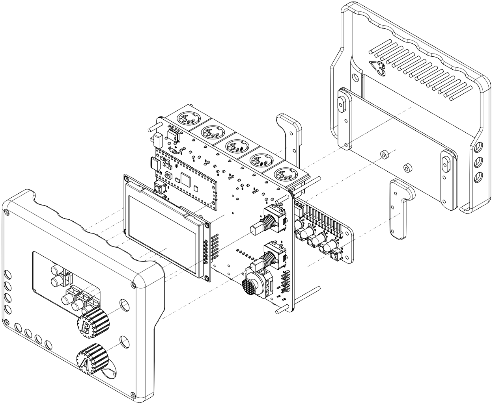

<!--  -->

<p align="center">
  
</p>

<h1 align="center">
<i>Ahhhhh ! The Stepchild!</i>
</h1>

<!-- borrowing heavily from the europi page -->

<!-- intro -->
  
Welcome to the github page for the Stepchild! The Stepchild is an open source, generative MIDI instrument designed to be part step-sequencer, part notebook, and part utility.

The Stepchild has the capability to record and playback sequences of MIDI data while generating its own explorative MIDI data to sequence other instruments. It can act as a tool for writing music and for interfacing between MIDI, CV, and USB protocols. The Stepchild is designed to run on a Raspberry Pi Pico and can have custom firmware or additional applications loaded onto it using the Arduino IDE.

<!-- links to social media, reddit, website -->


<!-- capabilities -->
### Overview:
This page gives a brief overview of the hardware and software capabilities of the Stepchild. For more information on specific controls and applications please take a look at the [Stepchild Manual](). If you're looking to make your own, please take a look at the [Build Guide]() which gives an overview of the materials and process for building assembling a Stepchild.

I currently sell the Stepchild over at the [official site](https://alexlafetra.github.io/stepchild.html), where you can also buy a kit if you'd like to assembly the Stepchild yourself. Right now, the hardware and software for this project is a solo project, but please get in touch if you'd like to contribute!
  

# Hardware:

The Stepchild has 4 hardware MIDI out ports and 1 hardware MIDI In port, supporting both 3.5mm TRS and the original 5-pin-DIN connector MIDI standard, as well as USB MIDI in/out using the Pi Pico's microUSB port. In total, up to 8 instruments and 1 computer can be connected to output channels from the Stepchild on 4 separate hardware ports.


The heart of the Stepchild is a Raspberry Pi Pico, which is a cheap, accessible microcontroller. The electronics of the Stepchild are split into two boards; on the top board, the Pico drives a monochrome 128x64 OLED screen, 8 main buttons, two rotary encoders, and an XY joystick. The bottom board holds the 8 step-buttons and indicator LEDs. The Stepchild also exposes 3 extra pins for CV
(although the MIDI-CV features still need to be tested) and one for accessing the Pico's ADC to read in data from a 3.3v analog sensor. Everything on the Stepchild uses 3.3V; The MIDI ports use the 3.3V MIDI standard, and the CV voltages range from ~0-3.3V.

A basic map of the top controls:

```
                  In 1  Out 1 Out 2 Out 3 Out 4
                   ^     ^     ^     ^     ^
                   |     |     |     |     |		  .--------.	
                   |     |     |     |     |             / Controls |
                .-------------------------------.  	.========================.
              +                                  +	|  In --  MIDI Input     |
              .                             _    . 	|  1  --  MIDI Output 1  |
              |        ._______________.  / A \  | 	|  2  --  MIDI Output 2  |
              |        | \00000\   \000|  \ _ /  | 	|  3  --  MIDI Output 3  |
USB In/Out <--|        |\ \00000\   \00|    _    | 	|  4  --  MIDI Output 4  |
              |        |0\ \00000\   \0|  / B \  | 	|                        |
              |        |00\ \00000\   \|  \ _ /  | 	|  A -- Rotary Encoder A |
              |  (+)   *---------------*         | 	|  B -- Rotary Encoder B |
              |  (s)                    _____    | 	|                        |
              |  (#)                   /     \   | 	| (0) -- Joystick        |
              .  (-)                   { (0) }   . 	|                        | 
              +.    (L)(>)(^)(?)       \_____/  .+ 	| (+) -- New             |
                ^------------------------------^	| (s) -- Shift           |
                                |  |  |  |  |	        | (#) -- Select          |
                                |  |  |  |  |	        | (-) -- Delete          |
                                v  v  v  v  v	        | (L) -- Loop            |
                                I1 O1 O2 O3 O4          | (>) -- Play            |
							| (^) -- Copy            |
							| (?) -- Menu            |
							\========================/
```


# Software Features:

The firmware running on the Stepchild is called 'ChildOS' and is designed to be easy to use and to create new generative MIDI instruments and effects for. Everything is
run by the two cores of the onboard Pi Pico.

As of version 1.0, ChildOS has a powerful sequencer, looper, and Automation function generator, as well as 9 instruments and FX. There are a total of 16 Instrument slots and 24 FX slots that can be swapped with user-created code written in C++ (See documentation on [creating custom instruments]() for a tutorial).


### Main Features:
1. A graphical interface
2. A step sequencer
3. A note editor
4. A track editor
5. A CC Automation ("Autotrack") sequencer
6. A customizeable looper, with up to 256 loops of any length
7. An onboard file system
8. A randomizer
9. An arpeggiator
10. A console to view incoming MIDI data
11. A customizeable clock, integrated with Autotracks for weird timing

### Instruments & FX:
1. Joystick-to-CC -- <i>Use the Stepchild's joystick as a MIDI controller</i>
2. Rain           -- <i>Generate ambient notes</i>
3. Rattlesnake    -- <i>Output notes wth varying speed</i>
4. Knobs          -- <i>Use the Stepchild's encoders as MIDI controllers</i>
5. Quantizer
6. Humanizer
7. Strum
8. Echo
9. Reverse

# Filesystem & ChildOS Interface

The Stepchild uses [LittleFS]() to set aside 1MB of the Pico's onboard flash memory to store settings and sequence files. [ChildOS Interface](https://github.com/alexlafetra/childOSInterface) is a standalone Java app that lets you download saved files from the Stepchild, or to <i>convert</i> .child files to .MIDI files that can be played back in a DAW. 



# Features Under Construction

I don't currently own any CV-capable instruments, so I don't have a good way of testing the CV features! When experimenting with Eurorack, keep in mind that nothing should be going IN to the Stepchild. Eurorack signals use a range of voltages, often way higher than the 3.3V the Stepchild can handle, so it's important to use the Stepchild <b>only as a CV output.</b>

Unfortunately, without a pretty substantial redesign, V1.0 of the Stepchild can only support 3.3V signalling. That means that all CV Pitch signals the Stepchild sends are going to be locked to a ~3 octave range, which is a big compromise.


# Thank you
<!-- libraries childOS relies on -->
The Stepchild is built using the hard work of a lot of other people. A special thanks to the creators and maintainers of the following projects that ChildOS uses:

 * adafruit gfx library
 * adafruit ssd1309 library
 * adafruit tinyusb
 * littleFS project
 * earle philhowers pico core
 * kicad <3

