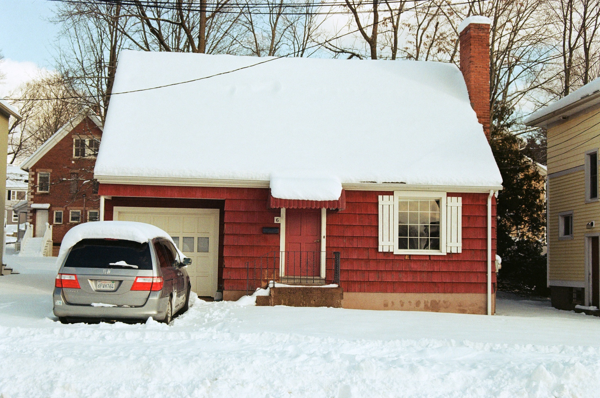

###### *My house, winter 2021*

My final year of college, in the dead of winter, in Middletown Connecticut, I was wracked with nostalgia. My first experience with any kind of music creation was an app on my first phone, the timeless *FL Studio Mobile*. Yeah, that's right. ***Mobile***. I miss the simplicity and toy-ness of this application; the accessible step sequencer and piano roll editor that focused on *note* editing made it engaging and simplistic and unique among modern DAWs.

###### *2011 FL Studio Mobile, the first music making app I used and, in retrospect, a big influence on the design of the Stepchild*

I was feeling especially nostalgic for FL Studio Mobile because my instrument of choice, the SP404, had at the time a seriously defficient sequencer. Since then, Roland has added a step sequencer and streamlined the pattern building process a little, but I still think for such an awesome instrument it deserves a better sequencer.

That winter, I began coding what would become the first version of ChildOS on an Arduino Mega. The goal was simple: create a sequencer that was easy to use, fun to engage with, but also complex enough that in theory and given enough time almost any song could be programmed into it.

I didn't set out to recreate FL Studio Mobile, but I think it's influence over the way I think about songs is evident from the design of the Stepchild's UI, and I'm proud of that. At the end of the day, FL Studio Mobile was a highly unserious program with all the potential for creating serious things and that's a legacy I think the Stepchild should build from.
