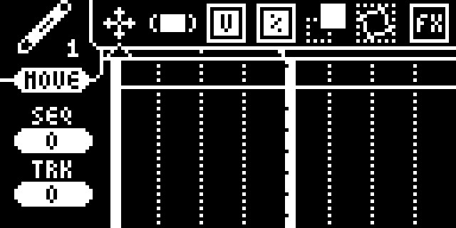

# Index
0. [Introduction](#0-introduction)
    1. [Overview](#01-overview)
    2. Hardware
        1. Buttons
        2. MIDI Layout
    3. Software
        1. Notes
        2. Tracks
        3. Internal clock
1. [Main Sequence](#1-main-sequence)
    1. [Moving the cursor](#11-moving-the-cursor)
    2. [Changing the view/Subdivision](#12-changing-the-view--subdivision)
    3. [Creating notes](#13-creating-notes)
    4. [Deleting & Muting Notes](#14-deleting--muting-notes)
    5. [Selecting notes]
    6. Moving loops
    7. Copy/paste
    8. Changing Tracks
    9. Status Icons
2. Menus
    1. [Track Menu](#21-track-menu)
        1. Utilities
    2. [Edit Menu](#22-edit-menu)
        1. Moving Notes
        2. Changing Note Length
        3. Changing Note Velocity
        4. Changing Note Probability
        5. Quantizing Notes
        6. Humanizing Notes
        7. QuickFX
    3. Main Menu
    4. Autotrack Menu
    5. Loop Menu
    6. Instrument Menu
    7. Settings Menu
        1. Sequence
        2. System
    10. FX Menu
    11. MIDI Menu
        1. Routing
        2. CV
        3. Thru
    12. File Menu
    13. [Clock Menu](#213-clock-menu)
        1. [BPM](#a-bpm)
        2. [Swing](#b-swing)
        3. [Clock Source](#c-clock-source)
3. Autotracks
    1. Editor Controls
    2. CC List
    3. Internal CC Messages
    4. Note about Ableton
4. Loops
    1. Types of loops
    2. Editing within Loop
5. Arpeggiator
    1. Step Lengths
    2. Modifiers
6. Randomizer
    1. Randomizer Settings
    2. Selecting an Area
7. Instruments
    1. XY
    2. Storm
    3. Knobs
    4. Keys
    5. Drumpads
    6. MIDI to CV
    7. Rattle
    8. Live Loop
8. FX
    1. Quantize
    2. Humanize
    3. Strum
    4. Echo
    5. Reverse
    6. Warp
9. [Quicksave](#10-quicksave)
10. [Console](#11-console)

# 0. Introduction

### 0.1 Overview

Hello! Welcome to the Stepchild User Manual. This document begins in a lot of detail, but slowly gets a more loose and conceptual as it goes on. Hopefully, this makes it easy to read and less redundant, but it also means that jumping straight into a later section might be more confusing than helpful. Because of this, there are a lot of links to other sections! Ideally, if something is confusing to you, you should be able to click it and it will link you to its explanation.

### 0.2 Hardware

#### a. Buttons

There are 8 buttons on the face of the Stepchild, two push encoders A and B, and one Joystick. The icons below are ~roughly~ shown in the same layout, with the literal name for each button next to the icon that this manual will use to reference it.

**New** ---- &nbsp;&nbsp;&nbsp;&nbsp;&nbsp;&nbsp;&nbsp;&nbsp;&nbsp;&nbsp;&nbsp;&nbsp;&nbsp;&nbsp;&nbsp;&nbsp;&nbsp;&nbsp;&nbsp;&nbsp;&nbsp;&nbsp;&nbsp;&nbsp;&nbsp;&nbsp;&nbsp;&nbsp;&nbsp;&nbsp;&nbsp;&nbsp;&nbsp;&nbsp;&nbsp;&nbsp;&nbsp;&nbsp;&nbsp; -- **A**<br>
**Shift** ---- &nbsp;&nbsp;&nbsp;&nbsp;&nbsp;&nbsp;&nbsp;&nbsp;&nbsp;&nbsp;&nbsp;&nbsp;&nbsp;&nbsp;&nbsp;&nbsp;&nbsp;&nbsp;&nbsp;&nbsp;&nbsp;&nbsp;&nbsp;&nbsp;&nbsp;&nbsp;&nbsp;&nbsp;&nbsp;&nbsp;&nbsp;&nbsp;&nbsp;&nbsp;&nbsp;&nbsp;&nbsp;&nbsp;&nbsp; -- **B**<br>
**Select** -- <br>
**Delete** -- &nbsp;&nbsp;&nbsp;&nbsp;&nbsp;&nbsp;&nbsp;&nbsp;&nbsp;&nbsp;&nbsp;&nbsp;&nbsp;&nbsp;&nbsp;&nbsp;&nbsp;&nbsp;&nbsp;&nbsp;&nbsp;&nbsp;&nbsp;&nbsp;&nbsp;&nbsp;&nbsp;&nbsp;&nbsp;&nbsp;&nbsp;&nbsp;&nbsp; -- **Joystick**<br>

&nbsp;&nbsp;&nbsp;&nbsp;&nbsp;&nbsp;&nbsp;&nbsp;&nbsp;&nbsp;&nbsp;&nbsp;&nbsp;&nbsp;&nbsp;&nbsp;&nbsp;&nbsp;&nbsp;&nbsp;&nbsp;&nbsp;&nbsp;&nbsp;&nbsp;&nbsp;&nbsp;   <br>
&nbsp;&nbsp;&nbsp;&nbsp;&nbsp;&nbsp;&nbsp;&nbsp;&nbsp;&nbsp;&nbsp;&nbsp;&nbsp;&nbsp;&nbsp;&nbsp;&nbsp;&nbsp;&nbsp;&nbsp;&nbsp;&nbsp;&nbsp;&nbsp;&nbsp;&nbsp;&nbsp;&nbsp;&nbsp;&nbsp;| &nbsp;&nbsp;&nbsp;&nbsp;&nbsp;| &nbsp;&nbsp;&nbsp;&nbsp;&nbsp;| &nbsp;&nbsp;&nbsp;&nbsp;&nbsp;| <br>
&nbsp;&nbsp;&nbsp;&nbsp;&nbsp;&nbsp;&nbsp;&nbsp;&nbsp;&nbsp;&nbsp;&nbsp;&nbsp;&nbsp;&nbsp;&nbsp;&nbsp;&nbsp;&nbsp;&nbsp;&nbsp;&nbsp;&nbsp;&nbsp;&nbsp;&nbsp;&nbsp;&nbsp;&nbsp;&nbsp;| &nbsp;&nbsp;&nbsp;&nbsp;&nbsp;| &nbsp;&nbsp;&nbsp;&nbsp;&nbsp;| &nbsp;&nbsp;&nbsp;&nbsp; **Menu** <br>
&nbsp;&nbsp;&nbsp;&nbsp;&nbsp;&nbsp;&nbsp;&nbsp;&nbsp;&nbsp;&nbsp;&nbsp;&nbsp;&nbsp;&nbsp;&nbsp;&nbsp;&nbsp;&nbsp;&nbsp;&nbsp;&nbsp;&nbsp;&nbsp;&nbsp;&nbsp;&nbsp;&nbsp;&nbsp;&nbsp;| &nbsp;&nbsp;&nbsp;&nbsp;&nbsp;| &nbsp;&nbsp;&nbsp;&nbsp;&nbsp;**Copy** <br>
&nbsp;&nbsp;&nbsp;&nbsp;&nbsp;&nbsp;&nbsp;&nbsp;&nbsp;&nbsp;&nbsp;&nbsp;&nbsp;&nbsp;&nbsp;&nbsp;&nbsp;&nbsp;&nbsp;&nbsp;&nbsp;&nbsp;&nbsp;&nbsp;&nbsp;&nbsp;&nbsp;&nbsp;&nbsp;&nbsp;| &nbsp;&nbsp;&nbsp;&nbsp; **Play** <br>
&nbsp;&nbsp;&nbsp;&nbsp;&nbsp;&nbsp;&nbsp;&nbsp;&nbsp;&nbsp;&nbsp;&nbsp;&nbsp;&nbsp;&nbsp;&nbsp;&nbsp;&nbsp;&nbsp;&nbsp;&nbsp;&nbsp;&nbsp;&nbsp;&nbsp;&nbsp;&nbsp;&nbsp;&nbsp;&nbsp;**Loop** <br>

Alongside the 8 face buttons and two encoders, there are 8 stepbuttons along the lower board of the Stepchild. The 8 stepbuttons are used to toggle steps directly, like you would be able to with a more traditional hardware step sequencer. Occaisionally, the stepbuttons and LEDs have some auxilary functions within different applications. 

#### b. MIDI Layout

The Stepchild has 5 MIDI out ports and 2 MIDI in ports, 1 pair of which uses the Stepchilds MicroUSB port. The 5 non-USB hardware ports are each exposed as both a **TRS Type-A** 3.5mm headphone jack (like you'd use with an aux cable) *and* the traditional 5-Pin-DIN MIDI connector. Each pair of jacks are hardwired together, and will always transmit the same signals. It's designed this way to work


EX: "Output 1" on the back of the Stepchild will send the same signals that "Output 1" on the front of the Stepchild will.

Because of this, the Stepchild has 4 unique hardware and 1 unique software outputs, *but* you can connect up to **9** instruments directly to the Stepchild. 

The Stepchild will expose itself as a MIDI device when it's connected to a computer, and should hopefully be easy to select from the MIDI input settings of a DAW. 


### 0.3 Software

The Stepchild is the hardware system that the ChildOS firmware uses to make music. The ChildOS firmware contains a bunch of MIDI editing tools, live generative applications, a sequencer, and a sequencer that uses the Stepchild's hardware to exchange MIDI messages with other instruments.

###### (ChildOS isn't really an operating system, it uses the 'OS' suffix because it looks cool)

This manual is written about using ChildOS with the Stepchild, the software that I created to use it as a MIDI instrument, but it totally does not need to exclusively run ChildOS. Going into flashing your own firmware for the Stepchild is a little outside the scope of this user manual, but see the **Stepchild Documentation** for a tutorial.

#### a. Notes

ChildOS's concept of notes is a little different than the way traditional MIDI software and written music treats them. Because the Stepchild is designed with a focus on rhythm *and* harmony/melody, Notes are stored as start-stop signals at certain velocities and don't contain any information about pitch or channel.


```
           + ---------------- +
Start -->  | / / Velocity / / | <-- End
           + ---------------- +
```

By default, notes are *shaded* by their velocity, with quieter notes being more opaque. Note sprites can also be configured to be shaded by their probability.

Notes can be created and deleted in the [Main Sequence](#13-creating-notes), but can be more extensively edited and messed with in the [Edit Menu](#22-edit-menu) and using the [FX Applications](#8-fx).

#### b. Tracks

Tracks hold the pitch and channel information that is usually associated with individual notes. This lets the pitch and routing of different notes change fluidly by changing the pitch of each track (if it's helpful, you can think about it like changing instruments or an FX stack on a track in a DAW without changing the MIDI notes).

Track 

# 1. Main Sequence
The first thing you see after the Stepchild boots up will be the Main Sequence screen. This is the “homepage” of the Stepchild where you can directly edit a sequence and access applications and menus. The Main Sequence screen *always* displays a baby carriage in the top left corner that bounces to the BPM of the sequence.


The main sequence is displayed like a piano roll found in traditional DAWs and instruments, with time on the X axis and separate [tracks](#032-tracks) on the Y axis. Track pitches are shown on the left as either MIDI note numbers or western chromatic pitches, and the sequence is displayed on the right. You can view the channel of each track by holding . The current [**loop points**](#15-moving-loops) and [**status icons**](#18-status-icons), like battery life,  are shown at the top of the Main Sequnce screen.

### 1.1 Moving the cursor

The **cursor** is positioned at a specific timestep (its horizontal location) and track (its vertical location). You can change which track the cursor is on by moving the [**Joystick**](#hardware) , which will automatically send a MIDI note at the new active track’s pitch to the Stepchild’s MIDI ports.

The cursor can be moved through time by moving the Joystick , which will move the cursor to the left or right to the next closest subdivision. Holding shift will move the cursor exactly 1 timestep in that direction.

### 1.2 Changing the View & Subdivision

The sequence display will automatically adjust depending on where the cursor is and how zoomed in the view is. Turning  will multiply or divide the view subdivision by 2, and holding shift while turning  will switch between triplet and base-2 subdivisions. Turning  will zoom the sequence in or out by 2x and also increase or decrease the subdivision, allowing for smoothly zooming in and out to place notes with more precision.

Clicking  will open the [Edit Menu](#22-edit-menu), and clicking  will open the [Track Menu](#21-track-menu).

### 1.3 Creating Notes
Pressing  will create a note 1 subdivision long and move the cursor to the end of the new note. If  is held while the cursor is moved, the note placed will be extended until  is released. If a note is created on top of another note, it will truncate the blocking note and insert itself into the sequence as long as it wasn't attempted to be placed on the exact timestep the blocking note starts on; new notes can't delete notes that are blocking them.

The default velocity of placed notes can be quickly changed by holding **Shift** and moving the **Joystick** up or down. If the cursor is over a note, or if any notes are selected, the velocity of that note and all selected notes will be changed instead of the default velocity, allowing you to tweak note velocities without going into the edit menu.

### 1.4 Deleting & Muting Notes
You can delete notes by hovering over them and pressing, you guessed it, . Instead of deleting notes,  +  will **mute** a note. Muted notes won't be sent as MIDI data, but can still be edited and used as the target of [**FX applications**](). 

Both muting and deleting will apply to *all* selected notes, so make sure to deselect notes you don't want to delete!

### 1.5 Selecting Notes
Most operations that affect a single note will also apply to other notes that are **selected**. Notes can be selected and deselected by placing the cursor on them and pressing , or by holding down  while moving the **Joystick** to create a selection box. By default, selecting is *additive*, meaning each note you select gets added to the current selection.To reset all selected notes you can press  +  over a note or a blank space.

### 1.6 Moving Loops
### 1.7 Copy/Paste
### 1.8 Changing Tracks
### 1.9 Status Icons

# 2. Menus

## 2.1 Track Menu


## 2.2 Edit Menu


## 2.13 Clock Menu

The Stepchild's **Clock Menu** has 3 parameters that can be experimented with to affect the timing of the sequence. 
### a. BPM 
The first, BPM, represents the Beats-per-minute (technically, 1/4 notes/minute or 24 timesteps/minute) of the sequence. Twisting will increase or decrease the BPM by 10, while twisting  or holding shift while turning will increase or decrease the BPM by 1.
### b. Swing
### c. Clock Source

The Stepchild can either use its internal clock, or wait for an external clock to tell it time has passed with a **MIDI Clock** message. Pressing  will swap between using an internal or external clock.


# 8. FX

# 9. 

# 10. Quicksave
Selecting the quicksave icon  allows you to quicksave your sequence without going into the File Menu. If an older version of the current sequence has already been written to the Stepchild’s flash, quicksaving overwrites the old file with the current version. Holding  while quicksaving restores the previously saved version of the sequence. The quicksave feature is designed to be used like a save state for making backups! I highly recommend quicksaving every once in a while and before doing something drastic to your sequence.

If the current sequence hasn’t been saved before, quicksaving will prompt you to enter a filename and save the sequence.
