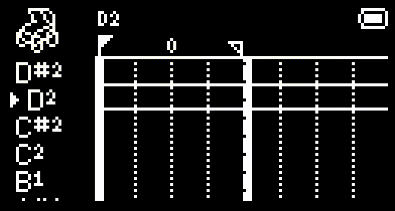

# Stepchild V1.0 - *User Manual*
###### V1.0 10.15.23


## Index
0. [Introduction](#0-introduction)
    1. [Overview](#01-overview)
    2. [Hardware](#02-hardware)
        1. [Buttons](#a-buttons)
        2. [MIDI Layout](#b-midi-layout)
    3. [Software](#03-software)
        1. [A Brief Intro to MIDI](#a-a-brief-intro-to-midi)
        2. [Notes](#b-notes)
        3. [Tracks](#c-tracks)
        4. [Timesteps](#d-timesteps)
1. [Main Sequence](#1-main-sequence)
    1. [Moving the cursor](#11-moving-the-cursor)
    2. [Changing the view/Subdivision](#12-changing-the-view--subdivision)
    3. [Creating notes](#13-creating-notes)
    4. [Deleting & Muting Notes](#14-deleting--muting-notes)
    5. [Selecting notes](#15-selecting-notes)
    6. [Moving loops](#16-moving-loops)
    7. [Copy/paste](#17-copypaste)
    8. [Playback](#18-playback)
        1. Playing
        2. Recording
    9. Status Icons
2. [Track Editor](#2-trackeditor)
    1. Changing Track Pitch
    2. Changing Track Octave
    3. Changing Track Channel
    4. Arming Tracks
    5. [Utilities](#25-track-utilities)
        1. [Editing Multiple Tracks](#a-editing-multiple-tracks)
        2. [Tuning Tracks to a Scale](#b-tuning-tracks-to-a-scale)
        3. [Delete Empty Tracks](#c-deleting-empty-tracks)
        4. [Disarming Tracks with Notes](#d-disarming-tracks-with-notes)
    6. Erasing Tracks
    7. Muting Tracks
    8. Moving Tracks
    9. Latching Tracks
3. [Note Editor](#3-note-editor)
    1. [Pattern Stencils](#31-pattern-stencils)
    2. [Moving Notes](#32-moving-notes)
    3. [Changing Note Length](#33-changing-note-length)
    4. [Changing Note Velocity & Probability](#34-changing-note-velocity--probability)
    5. [Quantizing Notes](#35-quantizing-notes)
    6. [Humanizing Notes](#36-humanizing-notes)
    7. [The FX Dropdown](#37-the-fx-dropdown)
4. [Menus](#4-menus)
    1. Main Menu
    2. Autotrack Menu
    3. Loop Menu
    4. Instrument Menu
    5. FX Menu
    6. Settings Menu
        1. Sequence
        2. System
    7. MIDI Menu
        1. Routing
        2. CV
        3. Thru
    8. File Menu
    9. [Clock Menu](#49-clock-menu)
        1. [BPM](#a-bpm)
        2. [Swing](#b-swing)
        3. [Clock Source](#c-clock-source)
    10. Arpeggiator Menu
    11. Randomizer Menu
    12. Console Menu
5. [Autotracks](#5-autotracks)
    1. Editor Controls
    2. CC List
    3. Internal CC Messages
    4. Note about Ableton
6. [Loops](#6-loops)
    1. Types of loops
    2. Editing within Loop
7. [Arpeggiator](#7-arpeggiator)
    1. Step Lengths
    2. Modifiers
8. [Randomizer](#8-randomizer)
    1. Randomizer Settings
    2. Selecting an Area
9. [Instruments](#9-instruments)
    1. XY
    2. Storm
    3. Knobs
    4. Keys
    5. Drumpads
    6. MIDI to CV
    7. Rattle
    8. [Live Loop](#98-live-loop)
10. [FX](#10-fx)
    1. [Quantize](#101-quantize)
    2. Humanize
    3. Strum
    4. Echo
    5. Reverse
    6. Warp
11. [Files](#11-files)
    1. [Quicksaving](#111-quicksaving)
    2. File Browsing
    3. Uploading to a computer
12. [Console](#12-console)
13. [Using the ChildOS Desktop Interface](#13-using-the-childos-desktop-interface)

# 0. Introduction

Hello! Welcome to the user manual for the Stepchild. I started this project a little over a year ago with the goal of creating a sequencer that I could use to experiment with my SP404MKII, but since then the Stepchild has become a fully-fledged instrument. 


###### *My house, winter 2021*

My final year of college, in the dead of winter, in Middletown Connecticut, I was wracked with nostalgia. My first experience with any kind of music creation was an app on my first phone, the timeless *FL Studio Mobile*. Yeah, that's right. ***Mobile***. I miss the simplicity and toy-ness of this application; the accessible step sequencer and piano roll editor that focused on *note* editing made it engaging and simplistic and unique among modern DAWs.


###### *2011 FL Studio Mobile, the first music making app I used and, in retrospect, a big influence on the design of the Stepchild*

I was feeling especially nostalgic for FL Studio Mobile because my instrument of choice, the SP404, had at the time a seriously defficient sequencer. Since then, Roland has added a step sequencer and streamlined the pattern building process a little, but I still think for such an awesome instrument it deserves a better sequencer.

That winter, I began coding what would become the first version of ChildOS on an Arduino Mega. The goal was simple: create a sequencer that was easy to use, fun to engage with, but also complex enough that in theory and given enough time almost any song could be programmed into it.

I didn't set out to recreate FL Studio Mobile, but I think it's influence over the way I think about songs is evident from the design of the Stepchild's UI, and I'm proud of that. At the end of the day, FL Studio Mobile was a highly unserious program with all the potential for creating serious things and that's a legacy I think the Stepchild should build from.

## 0.1 Overview

So, what is the Stepchild? In short, the Stepchild is a hardware sequencer and generative MIDI instrument.

*what is the stepchild*

## 0.2 Hardware

### a. Buttons

There are 8 buttons on the face of the Stepchild, two push encoders A and B, and one Joystick. The icons below are ~roughly~ shown in the same layout, with the literal name for each button next to the icon that this manual will use to reference it.

**New** ---- &nbsp;&nbsp;&nbsp;&nbsp;&nbsp;&nbsp;&nbsp;&nbsp;&nbsp;&nbsp;&nbsp;&nbsp;&nbsp;&nbsp;&nbsp;&nbsp;&nbsp;&nbsp;&nbsp;&nbsp;&nbsp;&nbsp;&nbsp;&nbsp;&nbsp;&nbsp;&nbsp;&nbsp;&nbsp;&nbsp;&nbsp;&nbsp;&nbsp;&nbsp;&nbsp;&nbsp;&nbsp;&nbsp;&nbsp; -- **A**<br>
**Shift** ---- &nbsp;&nbsp;&nbsp;&nbsp;&nbsp;&nbsp;&nbsp;&nbsp;&nbsp;&nbsp;&nbsp;&nbsp;&nbsp;&nbsp;&nbsp;&nbsp;&nbsp;&nbsp;&nbsp;&nbsp;&nbsp;&nbsp;&nbsp;&nbsp;&nbsp;&nbsp;&nbsp;&nbsp;&nbsp;&nbsp;&nbsp;&nbsp;&nbsp;&nbsp;&nbsp;&nbsp;&nbsp;&nbsp;&nbsp; -- **B**<br>
**Select** -- <br>
**Delete** -- &nbsp;&nbsp;&nbsp;&nbsp;&nbsp;&nbsp;&nbsp;&nbsp;&nbsp;&nbsp;&nbsp;&nbsp;&nbsp;&nbsp;&nbsp;&nbsp;&nbsp;&nbsp;&nbsp;&nbsp;&nbsp;&nbsp;&nbsp;&nbsp;&nbsp;&nbsp;&nbsp;&nbsp;&nbsp;&nbsp;&nbsp;&nbsp;&nbsp; -- **Joystick**<br>

&nbsp;&nbsp;&nbsp;&nbsp;&nbsp;&nbsp;&nbsp;&nbsp;&nbsp;&nbsp;&nbsp;&nbsp;&nbsp;&nbsp;&nbsp;&nbsp;&nbsp;&nbsp;&nbsp;&nbsp;&nbsp;&nbsp;&nbsp;&nbsp;&nbsp;&nbsp;&nbsp;   <br>
&nbsp;&nbsp;&nbsp;&nbsp;&nbsp;&nbsp;&nbsp;&nbsp;&nbsp;&nbsp;&nbsp;&nbsp;&nbsp;&nbsp;&nbsp;&nbsp;&nbsp;&nbsp;&nbsp;&nbsp;&nbsp;&nbsp;&nbsp;&nbsp;&nbsp;&nbsp;&nbsp;&nbsp;&nbsp;&nbsp;| &nbsp;&nbsp;&nbsp;&nbsp;&nbsp;| &nbsp;&nbsp;&nbsp;&nbsp;&nbsp;| &nbsp;&nbsp;&nbsp;&nbsp;&nbsp;| <br>
&nbsp;&nbsp;&nbsp;&nbsp;&nbsp;&nbsp;&nbsp;&nbsp;&nbsp;&nbsp;&nbsp;&nbsp;&nbsp;&nbsp;&nbsp;&nbsp;&nbsp;&nbsp;&nbsp;&nbsp;&nbsp;&nbsp;&nbsp;&nbsp;&nbsp;&nbsp;&nbsp;&nbsp;&nbsp;&nbsp;| &nbsp;&nbsp;&nbsp;&nbsp;&nbsp;| &nbsp;&nbsp;&nbsp;&nbsp;&nbsp;| &nbsp;&nbsp;&nbsp;&nbsp; **Menu** <br>
&nbsp;&nbsp;&nbsp;&nbsp;&nbsp;&nbsp;&nbsp;&nbsp;&nbsp;&nbsp;&nbsp;&nbsp;&nbsp;&nbsp;&nbsp;&nbsp;&nbsp;&nbsp;&nbsp;&nbsp;&nbsp;&nbsp;&nbsp;&nbsp;&nbsp;&nbsp;&nbsp;&nbsp;&nbsp;&nbsp;| &nbsp;&nbsp;&nbsp;&nbsp;&nbsp;| &nbsp;&nbsp;&nbsp;&nbsp;&nbsp;**Copy** <br>
&nbsp;&nbsp;&nbsp;&nbsp;&nbsp;&nbsp;&nbsp;&nbsp;&nbsp;&nbsp;&nbsp;&nbsp;&nbsp;&nbsp;&nbsp;&nbsp;&nbsp;&nbsp;&nbsp;&nbsp;&nbsp;&nbsp;&nbsp;&nbsp;&nbsp;&nbsp;&nbsp;&nbsp;&nbsp;&nbsp;| &nbsp;&nbsp;&nbsp;&nbsp; **Play** <br>
&nbsp;&nbsp;&nbsp;&nbsp;&nbsp;&nbsp;&nbsp;&nbsp;&nbsp;&nbsp;&nbsp;&nbsp;&nbsp;&nbsp;&nbsp;&nbsp;&nbsp;&nbsp;&nbsp;&nbsp;&nbsp;&nbsp;&nbsp;&nbsp;&nbsp;&nbsp;&nbsp;&nbsp;&nbsp;&nbsp;**Loop** <br>

Alongside the 8 face buttons and two encoders, there are 8 stepbuttons along the lower board of the Stepchild. The 8 stepbuttons are used to toggle steps directly, like you would be able to with a more traditional hardware step sequencer. Occaisionally, the stepbuttons and LEDs have some auxilary functions within different applications. 

### b. MIDI Layout

The Stepchild has 5 MIDI out ports and 2 MIDI in ports, 1 pair of which uses the Stepchilds MicroUSB port. The 5 non-USB hardware ports are each exposed as both a **TRS Type-A** 3.5mm headphone jack (like you'd use with an aux cable) *and* the traditional 5-Pin-DIN MIDI connector. Each pair of jacks are hardwired together, and will always transmit the same signals.


EX: "Output 1" on the back of the Stepchild will send the same signals that "Output 1" on the front of the Stepchild will.

Because of this, the Stepchild has 4 unique hardware and 1 unique software outputs, meaning you can connect up to **9** instruments directly to the Stepchild but the front 4 instruments will receive the same notes as the back 4. 

The Stepchild will expose itself as a MIDI device when it's connected to a computer, and MIDI messages can be routed to it from a DAW or other virtual MIDI program. Because of this, the Stepchild can act as a bridge between TRS MIDI, DIN MIDI, and USB MIDI platforms and can be used to sequence hardware instruments from a software program via USB MIDI.

## 0.3 Software


The Stepchild comes preloaded with ChildOS firmware, which contains MIDI editing tools, live MIDI generative applications, and a sequencer that uses the Stepchild's hardware to exchange MIDI messages with other instruments.

###### (ChildOS isn't really an operating system, it just uses the 'OS' suffix because it looks cool)

This manual is written about using ChildOS with the Stepchild, the software that I created to use it as a MIDI instrument, but it's possible to use the Stepchild with other firmware. Going into flashing your own firmware for the Stepchild is a little outside the scope of this user manual, so see the **Stepchild Documentation** for a tutorial.

This section of the manual gives a brief introduction to MIDI and then goes over the two basic elements of songs in ChildOS; notes and tracks. There are a few other important concepts in ChildOS, such as [Loops](#6-loops) and [Instruments](#9-instruments), but those get their own sections later on!

### a. A Brief Intro to MIDI

In case this is your first time encountering it, "MIDI" stands for ***Musical Instrument Digital Interface*** and is like a language that electronic instruments are able to speak to one another. There are a *lot* of different things that can be done with MIDI, but the primary MIDI concept that the Stepchild works with is MIDI Notes.

MIDI note messages are transmitted as "Note On" and "Note Off" messages, typically telling synthesizers and other instruments to start and stop playing a specific note. Note messages are sent as three bytes:

```
{'Pitch' | 'Velocity' | 'Channel'}
``` 

MIDI channels are numbered 1-16, with '0' sometimes denoting a global channel. Instruments will only respond to notes they receive that are sent on their channel, like an address that lets you send different messages to up to 16 instruments on the same MIDI cable.

The 'Pitch' value of a note is somewhere between 0 and 127 and corresponds to a pitch in the 12-tone western scale (although not all instruments implement this the same way). A lookup table of common pitch-note pairs can be found [here](https://computermusicresource.com/midikeys.html). Samplers and drum machines might respond to pitch information differently than a keyboard synethesizer would!

Finally, the 'Velocity' value sent with a note represents how loud or hard a note is played. How this is interpreted by a specific instrument, though, is up to that instrument. Samples can play different samples based on velocity data, and keyboards can modulate the waveform or envelope of a sound based on the velocity of the keypress.


### b. Notes

ChildOS's concept of notes is a little different than the way traditional MIDI software and written music treats them. Because the Stepchild is designed with a focus on interchangeably writing rhythm and melody, Notes are stored as start-stop signals at certain velocities and don't contain any information about pitch or channel. By keeping the pitch/channel data stored on a note's respective [Track](#c-tracks), you can flexibly play around with where the note is sent and what it sounds like without editing the notes themselves.

```
           + ---------------- +
Start -->  | / / Velocity / / | <-- End
           + ---------------- +
```

Alongside storing velocity, notes also store a value for their probability. When the sequence is playing and the playhead reaches the start position of a note, a die is rolled to determine if the note should play based on its probability. If it does play, a MIDI 'Note On' message is sent at the note's velocity, with the pitch and channel of the respective track. If the playhead reaches the end of the note, and that note was successfully played, a MIDI 'Note Off' message is sent.

By default, notes are shaded by their velocity, with quieter notes being more opaque. Note sprites can also be [configured](#45-settings) to be shaded by their probability.

###### An animation showing the different shade levels for different velocities and probabilities:


Notes can be created and deleted in the [Main Sequence](#13-creating-notes), and can be more extensively edited by pressing  to bring up the [Note Editor](#3-note-editor) or by using an [FX Application](#8-fx).

### c. Tracks

Tracks hold the pitch and channel information that is usually associated with individual notes. This lets the pitch and routing of different notes change fluidly by changing the pitch of each track (if it's helpful, you can think about it like changing instruments in a DAW without changing the MIDI notes).

Track pitch can be edited directly in the [Main Sequence](#1-main-sequence) by holding  and turning . Tracks can be more deeply edited in the [Track Editor](#2-track-editor) which can be accessed by pressing  in the Main Sequence.

### d. Timesteps

The sequences you can write using the Stepchild are broken into ***timesteps***, the smallest subdivision the Stepchild processes. A timestep is 1/24th of a beat, or a 1/96th note, which makes the Stepchild's clock 1:1 compatible with MIDI clock messages.

##### Because the BPM and timing of sequences is flexible, the actual duration value of a timestep in seconds or milliseconds varies, but it is *always* equivalent to 1/24th of a quarter note.

All note data is stored in terms of timesteps: a note begins on one timestep, and ends on another. Using the Stepchild's [swing](#b-swing) or [internal CC](#53-internal-cc-messages), timesteps can have different values depending on where they are in the sequence and what the Stepchild's clock is doing.

# 1. Main Sequence
The first thing you see after the Stepchild boots up will be the Main Sequence screen. This is the “homepage” of the Stepchild where you can directly edit a sequence and access applications and menus. The Main Sequence screen *always* displays a baby carriage in the top left corner that bounces to the BPM of the sequence.


The main sequence is displayed like the piano roll editor found in traditional DAWs, with time on the X axis and separate [tracks](#c-tracks) on the Y axis. Track pitches are shown on the left as either MIDI note numbers or western chromatic pitches, and the sequence grid is displayed on the right. You can view the channel of each track by holding . 

The current [**loop points**](#15-moving-loops) and [**status icons**](#18-status-icons), like battery life,  are shown at the top of the Main Sequnce screen.

## 1.1 Moving the cursor

The **cursor** is positioned at a specific timestep (its horizontal location) and track (its vertical location). You can change which track the cursor is on by moving the [**Joystick**](#hardware) , which will automatically send a MIDI note at the new active track’s pitch to the Stepchild’s MIDI ports.

The cursor can be moved through time by moving the Joystick , which will move the cursor to the left or right to the next closest subdivision. Holding shift will move the cursor exactly 1 timestep in that direction.

## 1.2 Changing the View & Subdivision

The sequence display will automatically adjust depending on where the cursor is and how zoomed in the view is. Turning  will multiply or divide the view subdivision by 2, and holding shift while turning  will switch between triplet and base-2 subdivisions. Turning  will zoom the sequence in or out by 2x and also increase or decrease the subdivision, allowing for smoothly zooming in and out to place notes with more precision.

At a certain level, when the sequence is zoomed out far enough, notes won't be able to render individually due to the low resolution of the Stepchild's screen. Instead, adjacent notes will render as a solid block and you'll need to zoom in to see individual notes again.

Clicking, instead of turning,  will open the [Note Editor](#3-note-editor), and clicking instead of turning  will open the [Track Editor](#2-track-editor).

## 1.3 Creating Notes
Pressing  will create a note 1 subdivision long at the cursor's position and active track, and move the cursor to the end of the new note. Alternatively, if  is held and the cursor is moved, a note will be created and extended by the cursor movement until  is released.



If a note is created on top of another note, it will truncate the blocking note and insert itself into the sequence, as long as it wasn't placed on the exact timestep the blocking note starts on; new notes can't delete or fully replace notes that are blocking them.

By default, new notes are placed with a velocity of 127, but the default velocity of notes can be quickly changed by holding  and moving the **Joystick**  while the cursor is over an empty part of the sequence. If the cursor is over a note, or if any notes are selected, the velocity of that note and all selected notes will be changed, allowing you to tweak note velocities without going into the edit menu.

## 1.4 Deleting & Muting Notes
You can delete notes by hovering over them and pressing, you guessed it, . To mute a note, you can hold  while pressing . Muted notes won't be sent as MIDI data, but can still be edited and used as the target of [**FX applications**](#10-fx) and can be unmuted by pressing  + .

###### Both muting and deleting will apply to *all* selected notes, so make sure to deselect notes you don't want to delete! When you attempt to delete multiple notes at once, you'll be asked to confirm as a way to safeguard against mass-deletions.

## 1.5 Selecting Notes
Most operations that affect a single note will also apply to other notes that are **selected**. Individual notes can be selected and deselected by placing the cursor on them and pressing , and groups of notes can be selected  by holding down  while moving the **Joystick** to create a selection box. By default, selecting is *additive*, meaning each note you select gets added to the current selection. To reset your selection, you can press  +  over a note or a blank space.


## 1.6 Moving Loops

The currently active [Loop](#6-loops) is always shown as two flags or lines, showing the start and end of the loop, and a number representing which loop is currently active from the loop chain. When the cursor is on one of these two loop points, they'll 'pop up' to let you know that you can move them.


Pressing  when hovering over a loop point will make the loop point get "stuck" to the cursor. While stuck, the loop point will move with the cursor until  is pressed again, which will set it wherever the cursor is. If the cursor is within the two loop points, rather than on one of them, both points will "stick" to the cursor and the loop can be moved in it's entirety.

## 1.7 Copy/Paste

You can copy currently selected notes by pressing . When notes are copied, they are copied *relative to the cursor position at the time of copying*. This means that when they are pasted, they will be pasted into the sequence with the same relative location to the cursor they had when they were copied, i.e. copying a note that is five tracks above the cursor means it will be pasted five tracks above the cursor.*

###### *(only if it's possible, notes that *would* be pasted outside the sequence won't be pasted at all)


To paste the notes on your clipboard to the sequence, hold  and press . Pasted notes will be automatically selected, allowing you to easily [delete](#14-deleting--muting-notes) them if you want to undo your paste. 


## 1.8 Playback

The Stepchild can record and play back sequences of [Notes](#b-notes) and [CC Data](#e-control-change-messages).

### a. Playing

### b. Recording

## 1.9 Status Icons

The top of the Main Sequence displays the [loop points](#6-loops), the current **Status Icons**, and a **tooltip** for the last action the user did (hopefully, the tooltip makes it easier to learn the control scheme).

Different status icons, each signifiying that a specific time-based event is actively taking place, will be displayed above the Main Sequence. Below is a list of all the status icons and what they signify:

 --> [One-shot recording](#b-recording) mode is on.

 --> The [Arpeggiator](#7-arpeggiator) is on.

 --> An [Autotrack](#5-autotracks) is active.


# 2. Track Editor


## 2.1 Changing Track Pitch
## 2.2 Changing Track Octave
## 2.3 Changing Track Channel
## 2.4 Arming Tracks
## 2.5 Track Utilities
## a. Editing Multiple Tracks
## b. Tuning Tracks to a Scale
## c. Deleting Empty Tracks
## d. Disarming Tracks With Notes


## 2.6 Erasing Tracks


# 3. Note Editor

The Note Editor screen has a special set of controls and functions dedicated to editing existing notes in a sequence, as well as a few oddball functions. The main feature of the Note Editor is the **Toolbar**, which can be navigated by holding  and moving .


From left to right, the tools on the Toolbar are: [Move](#32-moving-notes), [Length](#33-changing-note-length), [Velocity](#34-changing-note-velocity--probability),[ Probability](#34-changing-note-velocity--probability), [Quantize](#35-quantizing-notes), [Humanize](#36-humanizing-notes), and the [FX Dropdown](#36-the-fx-dropdown).

Instead of moving the cursor by [timesteps](#d-timesteps) as you would in the [Main Sequence](#11-moving-the-cursor), while in the Note Editor your cursor jumps directly between notes.

Pressing  will select the note the cursor has snapped to. Although it's a little clunky, you can also drag to create a selection box as you jump from note to note.

## 3.1 Pattern Stencils

One feature that is currently accessible in the Note Editor, but that might move to a different effect in the future, is the ability to ***stencil*** patterns of notes onto the sequence.

Stencilling a pattern places a note every 'N' subdivisions, letting you quickly create rythym sequences. You can set the stencil multiplier by holding  and turning . The stencil multiplier is shown as the small number underneath the Edit icon and determines how many subdivisions are skipped before a note is placed.

You can stencil a track with a pattern by holding  and pressing . The stencil will affect the track from the beginning to the end of the view.

## 3.2 Moving Notes

Pressing  while the Toolbar cursor is over the "Move" icon will let you move the note currently targeted by the cursor and well as all selected notes. Notes are "stuck" to the cursor relative to their distance when  was pressed.

If something is blocking a note you're trying to move, the cursor and all other moving notes will be blocked too. In cases where there are many notes in a dense pattern, it's usually quicker just to [select](#15-selecting-notes) the notes you want to move, [copy](#17-copypaste) them, [delete](#14-deleting--muting-notes) them, then paste new notes where you'd like them to go.

## 3.3 Changing Note Length

Pressing  while the Toolbar cursor is over the "Move" icon will let you change the length of the targeted note and all selected notes. The end of each selected note will be stuck to the cursor as it moves, letting you drag the cursor to extend or shrink notes.

## 3.4 Changing Note Velocity & Probability
## 3.5 Quantizing Notes
## 3.6 Humanizing Notes

## 3.7 The FX Dropdown

You are able to launch any of the [FX](#10-fx) applications directly from the note menu. Pressing  while the toolbar cursor is over the "FX" icon will bring up the FX selection menu. With this menu open, you can navigate to an effect and press  to launch it. All FX will launch and function the same way they do when run from the [FX Menu](#45-fx-menu).


You can close the FX dropdown by pressing  or .

# 4. Menus

The Stepchild's wide range of functionality is broken up between 9 menus.

## 4.1 Main Menu

## 4.2 Autotrack Menu

## 4.3 Loop Menu

## 4.4 Instrument Menu

## 4.5 FX Menu

## 4.6 Settings

## 4.7 MIDI Menu
### a. Routing
### b. CV
### c. Thru

## 4.8 File Menu
The Stepchild stores sequences on its internal flash storage with the '.child' extension. There is also a settings file that can't be browsed directly from the File Menu but *can* be updated in the [Settings Menu](#46-settings).

## 4.9 Clock Menu
The Stepchild has a flexible clock that runs on its own core of the Pi Pico. Rather than using timer interrupts, the clock on the second core keeps track of how **late** or **early** it was each time it fires and dynamically delays or advances itself to come back in time.

The Stepchild's **Clock Menu** has 3 parameters that can be experimented with to affect the timing of the sequence. 

### a. BPM 
BPM represents the Beats-Per-Minute (or 1/4 notes/minute, or 24 [timesteps](#d-timesteps)/minute) of the sequence. The BPM of the sequence determines when the Stepchild's clock can move to the next timestep as it's playing or recording. The pendulum of the Clock Menu's icon will keep time according to the BPM.


Twisting  will increase or decrease the BPM by 10, while twisting  or holding shift while turning  will increase or decrease the BPM by 1.

When the Stepchild is set to use an [external clock](#c-clock-source) the BPM of the sequence has no effect on the playback.

### b. Swing
The Stepchild has a Swing feature which generates offsets for its internal clock based on a Swing function. In short, the Swing function generates a "timing offset" based on where the playhead or recording head is in the sequence. This timing offset then delays or advances the internal clock and causes the speed of the sequence to speed up and slow down in a sinusoidal pattern.

###### Note: you can invert the swing curve! Experiment with it, the flexible clock might be the best feature of the Stepchild.

As of now, the swing function is always a pure sine wave that can have its period and amplitude edited on the second tab of the clock menu. Pressing  will toggle Swing on or off, turning  will change the period of the Swing curve, and turning  will change the amplitude of the curve.

### c. Clock Source
The Stepchild can either use its internal clock, or wait for an external clock to tell it time has passed with a **MIDI Clock** message. When you're on the third tab of the Clock Menu, pressing  will swap between using the internal or external clock.

MIDI clock signals are different from MIDI timecode signals, and only MIDI clock signals will be processed by the Stepchild. Each clock signal denotes 1/24th of a 1/4 note, which is exactly one timestep in the Stepchild's sequence. When hooked up to an external clock source, this means the Stepchild will advance 1 timestep (when playing or recording) for each MIDI clock message it receives. Using more flexible timing features like Swing and the internal BPM CC messages won't work when you're in external clock mode!

When the Stepchild is using its internal clock, it sends out clock messages every timestep. It also sends MIDI start and stop messages when the sequence is stopped and started, and can be used to control a DAW or another sequencer like Ableton Live (or... another Stepchild) if the DAW or sequencer is configured for remote control.

# 5. Autotracks
## 5.1 Autotrack Editor
## 5.2 CC List
## 5.3 Internal CC Messages
## 5.4 Ableton Issues

# 6. Loops
## 6.1 Types of Loops
## 6.2 Editing within a Loop

# 7. Arpeggiator
## 7.1 Setting Step Lengths
## 7.2 Modifiers

# 8. Randomizer

Originally, the Randomizer was one of the [FX](#10-fx), but it became such a key part of the Stepchild that it's included on the main menu.

## 8.1 Randomizer Parameters
## 8.2 Randomizing an Area

# 9. Instruments

"Instruments" are a category of applications which involve using the Stepchild as a controller to send MIDI messages in real time. This ranges from utility applications like [XY](#91-xy), where the Stepchild is used as a MIDI controller to send CC information, to more generative applications like [Storm](#92-storm) which uses the Stepchild like an instrument.

## 9.1 XY
## 9.2 Storm
## 9.3 Knobs
## 9.4 Keys
## 9.5 Drumpads
## 9.6 MIDI to CV
## 9.7 Rattle
## 9.8 Live Loop

The **Live Loop** application lets you quickly record and overdub MIDI data the way you might use a loop pedal in a guitar setup. **Live Loop** records MIDI data to a loop which doesn't exist outside of the **Live Loop** app. This means you can freely set your start/end loop points without affecting any existing loops.

#### If the sequence isn't playing yet: 
Pressing  and  will prime the sequence for a recording and wait for incoming MIDI messages. When a MIDI message is received, the Stepchild will begin recording notes. When recording in **Live Loop**, the [Loop](#6-loops) is ignored and the Stepchild will continue recording until the end of the sequence is reached. When  is pressed during a recording, the recording will stop, the recorded notes will be [Warped](#106-warp) to fit the active loop and the [BPM](#a-bpm) will be adjusted to maintain the timing of the recorded phrase. The sequence will automatically begin playing.

#### If the sequence has already started playing: 
You can start overdubbing another MIDI recording by pressing  and   (like you would start recording normally), or by pressing  (which is easier to do with one hand). By default, newly recorded notes **won't** overwrite ones from a previous dub and will instead be placed on new tracks.

You can toggle between creating new tracks and overwriting existing tracks by pressing .

# 10. FX

"FX" are used to alter and edit the notes of the main sequence, as opposed to [instruments](#9-instruments) which send MIDI data in real-time. Each FX application is accessible from the [FX Menu](#45-fx-menu) and from the dropdown in the [Note Editor](#3-note-editor). You can also [add your own custom FX](../src/stepchild/User/userApplications.h) to ChildOS.

## 10.1 Quantize

The Stepchild's quantizer is pretty standard. The "**amount**" parameter controls how strongly selected notes will obey the quantize effect; setting **amount** to "100%" makes all notes snap to where they need to go, whereas setting **amount** to "50%" makes all notes travel *halfway* towards where they need to go. This allows you to have more subtle quantization, where rigid time might not be necessary. You can change the **amount** parameter by turning  or by moving the cursor to the **amount** parameter by moving the Jostick  ~and then moving  while holding  to set the amount.~ (TBD)

The "grid" parameter dictates the grid each note will lock to. You can change the **grid** parameter by turning  or by moving the cursor to the **grid** parameter and then moving . Additionally, changing the subdivision while in the note selection screen will change the subdivision the notes are quantized to.

Finally, the "**delete colliding notes**" option lets you choose what happens when two notes are pushed onto the same subdivision. You can set it by navigating the cursor onto the grid parameter and twisting  and holding . Setting it to "**off**" leaves notes where they are if they're unable to find a nearby spot on the grid, and setting it to "**on**" will delete notes that can't find a nearby spot on the grid. By default, this is on.

Pressing  will push you to the note selection screen where you can [select notes](#15-selecting-notes) to quantize. You can continuously quantize notes by selecting and then pressing , or you can back out of the selection screen by pressing .


## 10.2 Humanize
## 10.3 Strum
## 10.4 Echo
## 10.5 Reverse
## 10.6 Warp

The **Warp** effect takes one section of sequence and deforms it to fit into another. This is useful for retiming sections of a sequence, and is automatically used in the [Live Loop](#98-live-loop) application to fit recorded notes into the active loop.

Sections of a sequence can be **Warped** to be bigger or smaller, although warping a note to be smaller than a 1/48th note (two timesteps) will cause it to ~be deleted~ warp out of existence.

# 11. Files

## 11.1 Saving

## 11.2 Quicksaving
Selecting the quicksave icon in the [Main Menu](#23-main-menu) allows you to quicksave your sequence without going into the File Menu. If an older version of the current sequence has already been written to the Stepchild’s flash, quicksaving overwrites the old file with the current version. Holding  while quicksaving restores the previously saved version of the sequence. Because the Stepchild lacks an undo ability, The quicksave feature is designed to be used for making backups before doing something iffy. Quicksave regularly because ChildOS *will occiasionally* crash and *does not autosave*.

###### *Why no autosave?* The Stepchild writes sequence data to the  Pico's onboard flash. Flash memory degrades every time its written, meaning you have a finite number of saves! Thus,the Stepchild isn't constantly autosaving to save its flash memory. 

###### I couldn't find a good source for how many write cycles the Pico's flash is rated for, but most flash storage falls in the range of 10k--100k cycles, which means you may get as few as 10k "saves" before the onboard flash is significantly degraded. So don't go crazy, but the good news is that saving a sequence 5x a day would give you at least 5 years worth of Stepchilding. You can be pretty liberal with it.


If the current sequence hasn’t been saved yet, quicksaving will prompt you to enter a filename and save the sequence like you would when [creating a new save](#111-saving).

## 11.3 Uploading to a Computer

# 12. Console

# 13. Using the ChildOS Desktop Interface
